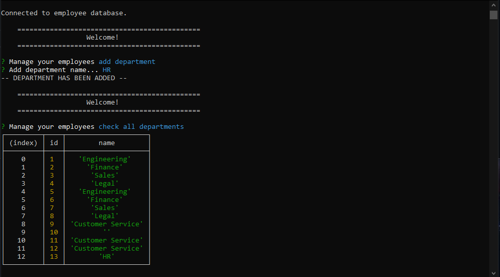
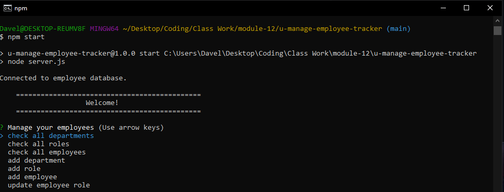

# Employee Tracker

## About This Project

#### The Employee u manage tracker is a command line application that allows you to create departments, roles, and employee information that is loaded into a database.

## How it works:

#### The program initializes from the command line connecting to a database table for employee. From there you are presented with a main menu of options prompting you to either check the data sets for departments, roles, and employees or you can add and update the aforementioned information.

### Successful command line connection

### Successfully adding department

## Challenges:

#### I ran into issues getting the update function to work as well as allowing the user to select through a choices option that would add a role id directly to your new employee.
